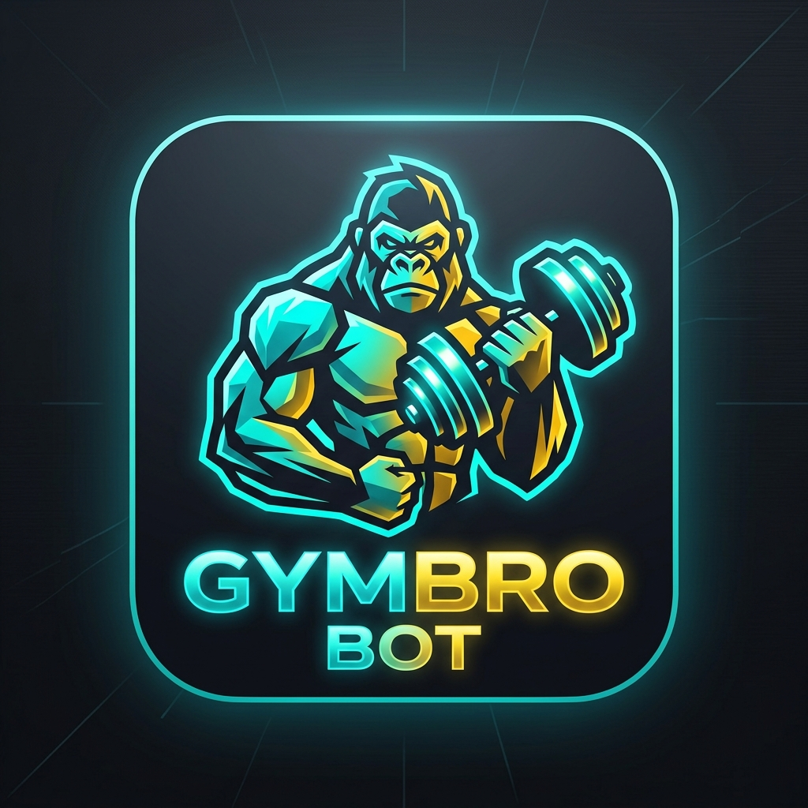

# 🦾 GymBroBot - Tu Coach Personal en Telegram



**GymBroBot** es un bot conversacional para Telegram desarrollado en **Node.js** que actúa como tu entrenador personal de gimnasio. Te ayuda a planificar tus sesiones de entrenamiento, calcular recomendaciones personalizadas según tus objetivos y explicarte la técnica adecuada de cada ejercicio de forma cercana y directa.

---

## ✨ Características Principales

- 💬 **Flujo Conversacional Amigable**: Habla contigo como tu colega de gimnasio.
- 🎯 **Detección Inteligente de Músculos**: Reconoce grupos musculares mediante jerga y variantes coloquiales (*pecho, pata, dorsales, core, abs, cardio, etc.*).
- 📋 **Rutinas Personalizadas**: Selecciona automáticamente la cantidad de ejercicios, series y repeticiones ajustados a tu peso y objetivo (*Ganar músculo*, *Perder peso* o *Mantenerme*).
- 🧠 **Banco de Explicaciones Detalladas**: Incluye explicaciones técnicas de más de 70 ejercicios para realizar las ejecuciones con técnica perfecta.
- ☁️ **Listo para la Nube**: Diseñado para desplegarse fácilmente 24/7 en plataformas como **Render** o **Koyeb**.

---

## 🛠️ Tecnologías Utilizadas

- **Node.js** (v18+)
- **node-telegram-bot-api** - SDK oficial para interactuar con la API de Telegram.
- **dotenv** - Gestión segura de variables de entorno.

---

## 🚀 Instalación y Configuración Local

### 1. Clonar el repositorio
```bash
git clone https://github.com/DaniielMG/MiGymBroBot.git
cd MiGymBroBot
```

### 2. Instalar dependencias
```bash
npm install
```

### 3. Configurar variables de entorno
Crea un archivo `.env` en la raíz del proyecto basándote en `.env.example`:
```env
TELEGRAM_TOKEN=tu_token_aqui_de_botfather
```

### 4. Iniciar el bot en modo local
```bash
npm start
```

---

## ☁️ Despliegue en Render (24/7 Gratis)

1. Conecta este repositorio en **[Render.com](https://render.com)**.
2. Crea un nuevo **Background Worker**.
3. Configura los comandos:
   - **Build Command**: `npm install`
   - **Start Command**: `npm start`
4. En la sección **Environment Variables**, añade:
   - Key: `TELEGRAM_TOKEN`
   - Value: `Tu token del bot obtenido en @BotFather`
5. ¡Despliega y tu bot estará disponible las 24 horas!

---

## 📝 Licencia

Este proyecto está bajo la licencia MIT. ¡Siéntete libre de contribuir o adaptar la rutina a tus necesidades! 🏋️‍♂️
